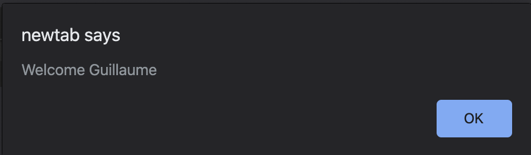

# Javascript advanced

## JavaScript

## Learning Objectives

1. What is lexical scoping in Javascript
2. What is closure in Javascript
3. How to use closure
4. How to chain different closures
5. How to simulate private methods with Closure
6. The execution stack order with Javascript
7. How to use binding
8. How to use callbacks

## Requirements

1. Recommended editors: Visual Studio Code
2. All your files should end with a new line
3. A README.md file, at the root of the folder of the project, is mandatory
4. Your code should use the js extension

## Tasks

### 0. Lexical scoping and welcome message

Create a function named welcome:

It takes two arguments: firstName (string) and lastName (string)

It contains a variable named fullName, that will contains the firstName followed by a space and then the lastName

Within the welcome function, write a function named displayFullName:

It should display an alert with the message Welcome followed by a space, then the variable fullName followed by an exclamation mark.

Call the function displayFullName at the end of the function welcome

How to test

Open your web inspector in the tab “Console”

Copy paste your code in the console and hit enter

Copy and paste this welcome('Holberton', 'School'); and hhit enter to run that code. It should prompt an alert with this content: Welcome Holberton School!

When you write and execute alert(fullName) afterwards, it should return a reference error fullName is not defined

### 1. Closure Scope Chain

Create a variable named globalVariable with value Welcome

Create a function outer that:

alerts the content of the variable globalVariable

creates a variable named course with value Holberton

creates a function inner that:

alerts the content of the variable globalVariable and course (concatenated)

creates a variable named exclamation with value !

creates a function inception that alerts the content of the variable globalVariable, course, and exclamation (concatenated)

calls the function inception

calls the function inner

Call the function outer

Compose the code:

Write the function inception within inner

Write the function inner within outer

Call the function outer in the main code (outside any function)

Call the function inner within outer

Call the function inception within inner

Requirements:

Running the script should display three popups one by one with the text Welcome, Welcome Holberton, and Welcome Holberton!

### 2. Closure

Write a function named welcomeMessage:

It accepts one argument fullName (string)

It should be a closure for an alert displaying Welcome <fullName>

After this function definition, create three variables:

guillaume contains a call welcomeMessage with Guillaume as argument

alex contains a call welcomeMessage with Alex as argument

fred contains a call welcomeMessage with Fred as argument

How to test:

In your web console, cop/paste your file

Executing the following in the console:

guillaume();

alex();

fred();

Should display three alerts like below:

### 3. Closure and loops

Write a function named createClassRoom:

It takes into argument numbersOfStudents (number)

Inside, it contains a function studentSeat, that takes into argument seat (number) and returns a function that returns the seat number

After the definition of studentSeat, create and populate a variable students (array)

Using a loop from 0 to numbersOfStudents, pass the number of iteration + 1 to studentSeat and add its return value to the students array

Returns the students array

Create a closure classRoom, calling createClassRoom with 10 students

Requirements:

Executing the following code:

    console.log(classRoom[0]());

    console.log(classRoom[3]());

    console.log(classRoom[9]());

Should return

    1

    4

    10

### 4. Complex Closure

Create a function divideBy:

It takes into argument firstNumber (number)

It returns a function that takes into argument secondNumber (number)

It returns the second number divided by the first number

Create a function addBy:

It takes into argument firstNumber (number)

It returns a function that takes into argument secondNumber (number)

It returns the sum of the two numbers

Create four closures:

addBy100, that uses the function addBy with the number 100

addBy1000, that uses the function addBy with the number 1000

divideBy10, that uses the function divideBy with the number 10

divideBy100, that uses the function divideBy with the number 100

Requirements:

Executing the following code:

    console.log(addBy100(20));

    console.log(divideBy10(20));

    console.log(divideBy100(200));

    console.log(addBy1000(20));

Should display in the console:

    120

    2

    2

    1020

### 5. Changing DOM with closure

Create a function named changeMode:

It accepts 5 arguments size (number), weight (string), transform (string), background (string), color (string)

Using closure, it changes the style of the entire page and set the font-size, font-weight, text-transform, background-color, and color

Write a function named main:

Set a variable named spooky that passes the arguments 9, bold, uppercase, pink, green to changeMode

Set a variable named darkMode that passes the arguments 12, bold, capitalize, black, white to changeMode

Set a variable named screamMode that passes the arguments 12, normal, lowercase, white, black to changeMode

Add a paragraph to the body of the page with the text Welcome Holberton!

Add a button to the body with the text Spooky

Add a button to the body with the text Dark mode

Add a button to the body with the text Scream mode

When clicking on each button, the page CSS should change to the different themes you created previously

Call the main function

Requirements:

Use vanilla javascript to add the elements to the DOM and change the style of the page

JQuery not allowed!

Clicking the Spooky button should change the web page to look something like this:

Clicking the Dark mode button should change the web page to look something like this:

Clicking the Scream mode button should change the web page to look something like this:

### 6. Private methods with closure

Write a module named studentHogwarts:

It contains two variables privateScore set to 0, and name set to null

It contains one private method changeScoreBy, it takes points in argument and add it to privateScore

The module gives access to four public methods (return an object):

setName, it takes into argument newName, and set the private variable name

rewardStudent, it calls the method changeScoreBy with 1

penalizeStudent, it calls the method changeScoreBy with -1

getScore, it returns name: score (ex: Harry: 14)

Create one variable named harry, that is an instance of studentHogwarts:

Set the name of the object to Harry

Reward the student four times

Log to the console the name and score

Create one variable named draco, that is an instance of studentHogwarts:

Sets the name of the object to Draco

Reward the student one time

Penalize the student three times

Log to the console the name and score

Requirements:

Executing the code should display in the console

    Harry: 4

    Draco: -2

### 7. Stack order and setTimeout

Write the following commands in the following order:

Log to the console Start of the execution queue

Log to the console Final code block to be executed using setTimeout (with delay of 0)

Using a loop that iterates 100 times, each iteration logs to the console the iteration number

Log to the console End of the loop printing
Requirements:

Your code should log to the console the following:

    Start of the execution queue

    1

    2

    ...

    100

    End of the loop printing

    Final code block to be executed
## Contributing

Contributions make the open-source community such an amazing place to learn, create and more. Any contributions you make are appreciated.

If you have a suggestion that would make this project better, please fork the repo and create a pull request. Don't forget to give the project a star! Thanks again!

1. Fork the Project
2. Create your Feature Branch (git checkout -b feature/GreatCode)
3. Commit your Changes (git commit -m 'Adding a GreatCode')
4. Push to the Branch (git push origin feature/GreatCode)
5. Open a Pull Request

## License & Copyright

Distributed under MIT license. See LICENSE.txt for more information.

In regards with copyright, all lie with the author.

## Contact

Hezrone Okoth

twitter @that_heazrone

Project Link: https://github.com/hezroneokoth/alx_javascript

## Acknowledgments

This is a list of resources that I have used during the course of this project;

ALX School Concept Page

Lexical scoping - https://javascript.info/closure 

Closure - https://www.w3schools.com/js/js_function_closures.asp

Call stack - https://developer.mozilla.org/en-US/docs/Glossary/Call_stack

Binding - https://javascript.info/bind

Callbacks - https://javascript.info/callbacks